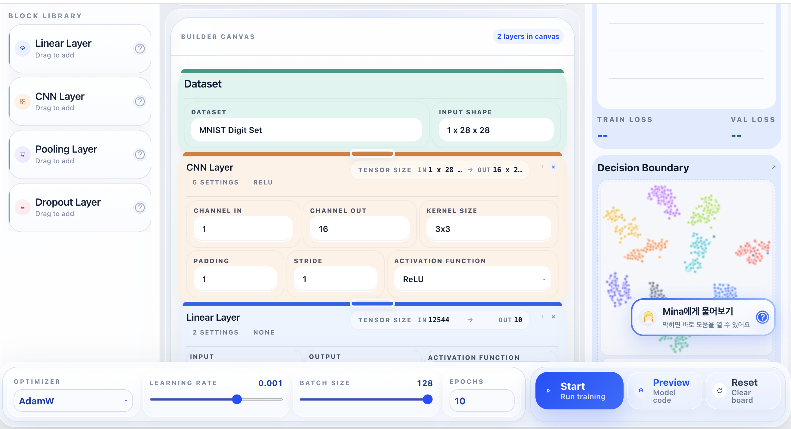
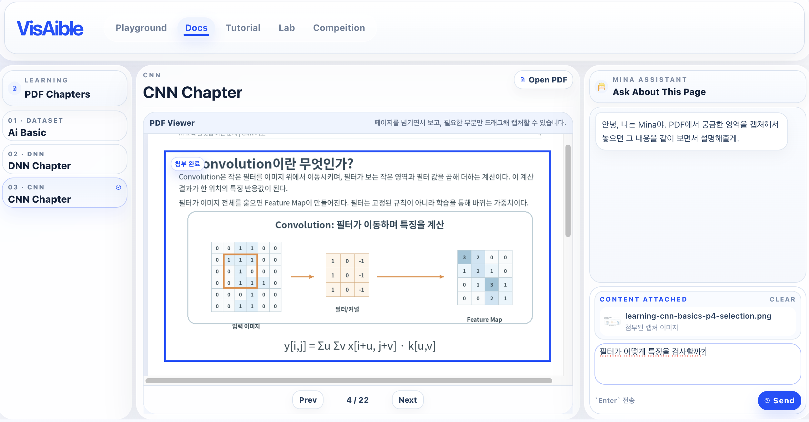
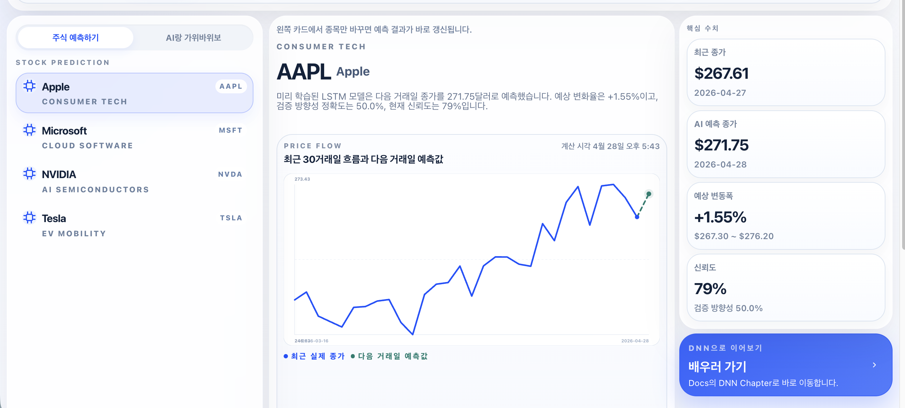
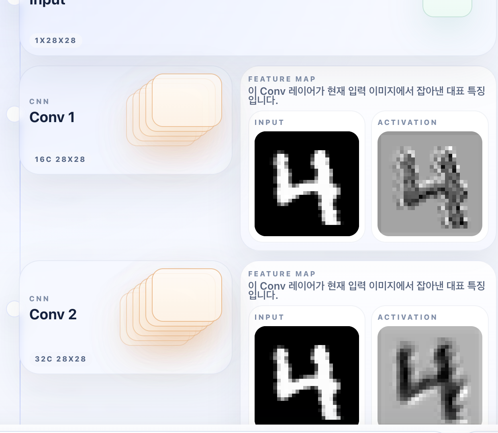
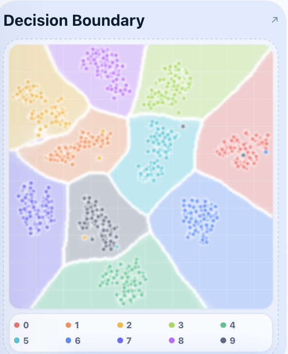
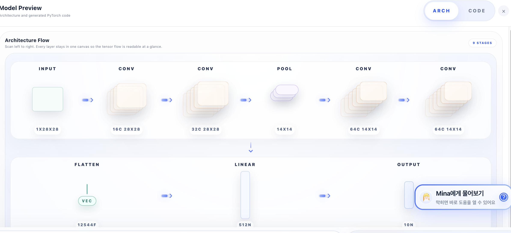

<div align="center">

# VisAIble

### 딥러닝 입문자를 위한 블록코딩 교육 플랫폼

VisAIble은 어려운 코드부터 보여주는 대신, 블록을 움직이며 모델을 직접 쌓고 시각화로 결과를 이해하게 만드는 학습 플랫폼입니다.  
Playground로 흥미를 만들고, Tutorial과 Docs로 원리를 익힌 뒤, Lab과 Competition에서 직접 실험하고 비교하는 흐름으로 설계했습니다.

<br />



<br />


</div>

---

## Beginner Deep Learning Education Platform

| Easy Coding | Visible Learning | AI Assistant |
|---|---|---|
| 복잡한 코드부터 보지 않아도 됩니다. 블록을 직접 움직이며 모델 구조를 쌓고 AI를 만드는 흐름을 먼저 이해합니다. | 학습 결과, 구조 변화, 분류 흐름처럼 글로만 보면 어려운 개념을 시각화해서 보여줍니다. | 자료를 읽다가 막히면 Mina에게 묻고, 실험하다가 막히면 가이드를 따라 다음 행동을 이어갑니다. |

## Product Preview

| Lab | Docs |
|---|---|
|  |  |
| 블록을 쌓고 학습 지표, 결정 경계, 모델 흐름을 한 화면에서 확인합니다. | DNN, CNN 이론을 PDF로 읽고 궁금한 부분은 Mina에게 바로 질문합니다. |

| Playground | Mini Game |
|---|---|
|  |  |
| 주식 예측처럼 결과가 바로 보이는 인터랙션으로 AI의 출력과 반응을 먼저 경험합니다. | 실시간 손 모양 인식 미니 게임으로 CNN이 바로 반응하는 기술이라는 점을 체험합니다. |

## Visible Outputs

| Feature Map | Decision Boundary | Model Preview |
|---|---|---|
|  |  |  |
| Conv 레이어가 입력 이미지에서 어떤 특징을 잡아내는지 확인합니다. | 모델이 각 클래스를 어떤 경계로 구분하는지 감각적으로 이해합니다. | 쌓아 둔 블록이 실제 아키텍처 흐름으로 어떻게 연결되는지 미리 봅니다. |

## Learning Journey

| Step | Workspace | Role |
|---:|---|---|
| 01 | **Playground** | 막연하게 공부만 시작하지 않고 AI로 실제 무엇을 만들 수 있는지 먼저 체험합니다. |
| 02 | **Tutorial** | 블록을 왜 이렇게 쌓는지 하나씩 따라 하며 사용법을 익힙니다. |
| 03 | **Docs** | 이론 자료를 읽고 Mina에게 질문하면서 DNN과 CNN 개념을 이어서 학습합니다. |
| 04 | **Lab** | 데이터셋, 구조, 증강, 하이퍼파라미터를 바꿔 보며 여러 실험을 직접 해봅니다. |
| 05 | **Competition** | 복잡한 제출 과정 없이 모델 구조와 튜닝 실력으로 간단히 겨룹니다. |

## Workspace Map

| Workspace | Description |
|---|---|
| **Playground** | AI가 실제로 무엇을 할 수 있는지 결과부터 체험하는 공간 |
| **Docs** | 이론 PDF와 Mina 질문을 붙여서 학습하는 공간 |
| **Tutorial** | 블록을 하나씩 따라 쌓으며 이해를 만드는 수업형 공간 |
| **Lab** | 주어진 데이터셋으로 구조와 파라미터를 실험하는 공간 |
| **Competition** | 복잡한 제출 과정 없이 튜닝 실력으로 승부하는 공간 |

---

## Project Structure

```text
VisAIble/
├─ frontend/   Next.js UI
├─ backend/    FastAPI + PyTorch training server
├─ visaible/   shared Python virtual environment
└─ gemma4/     gemma-4-E2B-it-litert-lm model files
```

## Requirements

| Tool | Version |
|---|---|
| Python | `3.12` |
| Node.js | `18+` |
| npm | latest stable |

> Python `3.13`은 이 프로젝트 환경에서 사용하지 않습니다.

## Environment Setup

Create the shared virtual environment once at the project root.

```bash
cd /path/to/VisAIble
python3.12 -m venv --clear visaible
source visaible/bin/activate
pip install --upgrade pip
pip install -r backend/requirements.txt
```

Install frontend dependencies:

```bash
cd /path/to/VisAIble/frontend
npm install
```

Download Gemma4 and put it in the `gemma4/` folder:

```text
https://huggingface.co/litert-community/gemma-4-E2B-it-litert-lm/tree/main
```

## Run Backend

The backend should use port `8000`.

```bash
cd /path/to/VisAIble
source visaible/bin/activate
cd backend
uvicorn app.main:app --host 127.0.0.1 --port 8000 --reload
```

Health check:

```bash
curl http://127.0.0.1:8000/health
```

Expected response:

```json
{"status":"ok"}
```

## Run Frontend

Run the frontend in a separate terminal:

```bash
cd /path/to/VisAIble/frontend
npm run dev
```

If you want a fixed port:

```bash
cd /path/to/VisAIble/frontend
PORT=3001 npm run dev
```

Open:

| Service | URL |
|---|---|
| Frontend | `http://localhost:3000` |
| Backend health | `http://127.0.0.1:8000/health` |

## Frontend API Base URL

By default the frontend uses:

```text
http://127.0.0.1:8000/api
```

If needed, override it with:

```bash
NEXT_PUBLIC_API_BASE_URL=http://127.0.0.1:8000
```

## MNIST Preparation

The training flow is currently implemented for `MNIST Digit Set`.

MNIST files are downloaded automatically when training starts, but you can also prepare them manually:

```bash
curl -X POST http://127.0.0.1:8000/api/datasets/mnist/prepare
```

## Full Local Startup

Terminal 1:

```bash
cd /path/to/VisAIble
source visaible/bin/activate
cd backend
uvicorn app.main:app --host 127.0.0.1 --port 8000 --reload
```

Terminal 2:

```bash
cd /path/to/VisAIble/frontend
npm run dev
```

## Notes

- Device priority is `CUDA -> MPS -> CPU`.
- The final layer must be a user-defined `Linear(n, class_num)` block.
- The final layer outputs logits directly for `CrossEntropyLoss`.
- Pooling blocks currently support `MaxPool`, `AvgPool`, and `AdaptiveAvgPool2d((1, 1))`.
